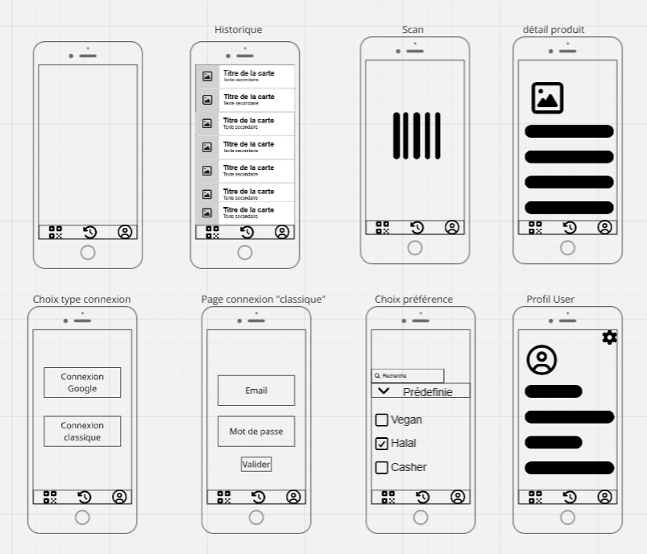

# 🛒 Scanner Alimentaire

**Scanner de codes-barres alimentaires avec vérification des régimes (Vegan, Halal, Casher)**

***

## 🚀 Lancer le projet — Guide rapide & précis

### 1. Prérequis
```bash
npm install -g @expo/cli@latest
node --version           # Vérifier que Node.js est au moins en version 18
```

### 2. Cloner et installer
```bash
git clone https://github.com/chbkSamy/Yuka_Bis.git
cd Yuka_Bis
npm install              # Installe toutes les dépendances nécessaires
```

### 3. Démarrer le projet
```bash
npx expo start           # Lance le serveur de développement
```

### 4. Tester sur mobile
- Ouvrir l’application **Expo Go** (disponible sur App Store et Google Play)
- Scanner le QR code affiché dans la console de `expo start`
- Autoriser l’accès à la caméra et scanner un produit

***

## 🛠 Commandes utiles

```bash
npx expo start --clear     # Redémarrer proprement en supprimant le cache
npm run android            # Lancer l’application sur un émulateur Android
npm run ios                # Lancer l’application sur un simulateur iOS (Mac uniquement)
npm run reset-project      # Réinitialiser la base locale / données (utile si erreur SQLite)
```

***

## 🐛 Problèmes fréquents et solutions rapides

| Problème               | Solution                        |
|------------------------|--------------------------------|
| Caméra bloquée         | Relancer avec `npx expo start --clear` |
| Produit non trouvé     | Normal - base de données communautaire |
| SQLite corrompu / erreur | `npm run reset-project`        |
| Metro bundler bloqué   | `npx expo start --clear`       |

***

## 🚀 Build pour production (APK / App Store)

```bash
npm install -g eas-cli    # Installer Expo Application Services CLI
eas login                 # Se connecter à Expo
eas build:configure       # Configurer le build pour la première fois
eas build --platform all  # Lancer le build multiplateforme
```

***

## 🗂 APIs utilisées (sans config à faire)

- Open Food Facts : accès public, gratuit, limite 100 requêtes/s
- SQLite : base locale utilisée pour cache et historique

***

## 🎨 Design & Organisation du projet

### Design

Lien vers la maquette:
👉 [Maquette du projet](https://miro.com/app/board/uXjVJqyYjQo=/)




***

### Schéma d’architecture

Schéma d’architecture :

(si mode sombre, cliquer droit sur l'image et choisir "ouvrir l'image dans un nouvel onglet" afin de voir le schéma correctement)


***

### Organisation du travail (Trello)

Lien vers le tableau Trello du projet :
👉 [Tableau Trello du projet](https://trello.com/b/2uh3KSrR/scanneraliment)


***
